# generic-cicd

Jenkins shared library for embedded CI/CD pipelines. Supports Yocto, AOSP, and custom firmware builds with Docker containers, artifact publishing, and multi-project integration.

## Architecture Overview



## How It Works

The library provides two entry points — both driven by YAML configuration:

- **`ciPipeline()`** — Single-project pipeline. Config lives in the project repo.
- **`pipeliner()`** — Multi-project pipeline. Config lives in a separate config repo. Syncs sources from a manifest, then builds each subsystem in parallel.

All build logic lives in external shell scripts (see **build-scripts**), referenced via YAML config. No embedded bash in Groovy — the pipeline only handles orchestration and artifact management. Cache management (sstate, downloads, ccache) is handled entirely by the build scripts.

```
Repo Structure (4 repos)
├── generic-cicd             shared library (this repo)
├── project-config           pipeline YAML configs per subsystem
├── build-scripts            build shell scripts (synced via manifest)
└── integration-manifest     repo manifest defining all sources
```

## Component Pipeline (`ciPipeline`)

For single-project builds. The project repo has a Jenkinsfile and `cicd.yml`:

```
my-project/
├── Jenkinsfile              @Library('generic-cicd') _ ; ciPipeline()
├── cicd.yml                 project type, stages, builder config
├── cicd-nightly.yml         build type override (optional)
└── platforms.yml            git/artifact adapter config (optional)
```

```groovy
// Jenkinsfile
@Library('generic-cicd') _
ciPipeline()
```

```yaml
# cicd.yml
project:
  name: my-firmware
  type: custom          # yocto | aosp | custom
  buildType: ci          # ci | nightly | release

environment:
  agent: "linux"
  timeout: 30
  docker:
    image: my-builder:latest

custom:
  buildScript: build-scripts/build.sh

stages: [checkout, build, publish, notify]
```

## Integration Pipeline (`pipeliner`)

For multi-project builds (e.g., Yocto + AOSP + custom firmware from a single manifest).

### Jenkinsfile

```groovy
@Library('generic-cicd') _
pipeliner(
    config: 'integration',
    configRepo: '<config-repo-url>',
    credentials: 'git-creds',
    agent: 'build-linux'
)
```

For nightly or release builds, use the corresponding config:

```groovy
// Nightly build (triggered by cron)
pipeliner(config: 'integration-nightly', configRepo: '...', credentials: '...')

// Release build (triggered manually)
pipeliner(config: 'integration-release', configRepo: '...', credentials: '...')
```

### Config Repo Layout

```
project-config/
└── projects/
    ├── integration.yml                 # CI integration build
    ├── integration-nightly.yml         # Nightly integration build
    ├── integration-release.yml         # Release integration build
    ├── custom-firmware.yml             # Subsystem config (ci)
    ├── custom-firmware-nightly.yml     # Subsystem config (nightly)
    ├── custom-firmware-release.yml     # Subsystem config (release)
    ├── yocto-bsp.yml                   # Subsystem config (ci)
    ├── yocto-bsp-nightly.yml           # Subsystem config (nightly)
    ├── yocto-bsp-release.yml           # Subsystem config (release)
    ├── aosp-platform.yml               # Subsystem config (ci)
    ├── aosp-platform-nightly.yml       # Subsystem config (nightly)
    └── aosp-platform-release.yml       # Subsystem config (release)
```

### Integration Config

```yaml
mode: integration

project:
  name: integration-build
  type: custom
  buildType: integration          # ci | nightly | release | integration

workspace: /var/jenkins/workspace/integration
cleanWorkspace: true

environment:
  agent: "audioi-linux"
  timeout: 720
  minDiskGB: 50

manifest:
  url: <manifest-repo-url>
  branch: main
  reference: /mnt/workspace/mirrors/reference

artifacts:
  type: artifactory
  url: https://your-artifactory.jfrog.io
  credentialId: artifactory-creds
  defaultRepo: firmware-builds

stages: [checkout, build, publish, notify]
failFast: true

subsystems:
  - custom-firmware
  - yocto-bsp
  - aosp-platform
```

Nightly and release variants (`integration-nightly.yml`, `integration-release.yml`) set `buildType: nightly` or `buildType: release` and reference their own subsystem configs (e.g., `custom-firmware-nightly`, `yocto-bsp-release`).

### Component Mode with `buildScripts`

Component mode clones a single project. Use `buildScripts` to fetch build scripts separately (since there's no manifest sync):

```yaml
mode: component

buildScripts:
  url: https://git.example.com/org/build-scripts.git
  branch: main

project:
  name: yocto-sdk-app
  repoUrl: https://git.example.com/org/yocto-sdk-app.git
  type: custom
  buildType: ci

custom:
  buildScript: build-scripts/component/cmake-build.sh
```

Relative paths are auto-resolved to absolute workspace paths.

### Subsystem Config

```yaml
project:
  name: yocto-bsp
  type: yocto
  buildType: ci

environment:
  agent: "audioi-linux"
  timeout: 300
  docker:
    image: yocto-builder:latest
    credentialId: artifactory-creds

yocto:
  buildScript: build-scripts/integration/yocto-build.sh

artifacts:
  type: artifactory
  url: https://your-artifactory.jfrog.io
  credentialId: artifactory-creds
  defaultRepo: firmware-builds

publish:
  artifacts:
    - pattern: "yocto/build/tmp/deploy/images/**/*.wic.bz2"
      repo: firmware-builds

stages: [checkout, build, publish, notify]
```

### How `pipeliner()` Works

1. **Load Config** — clones the config repo, reads `projects/<config>.yml`
2. **Validate Config** — checks mode, required fields, warns on issues
3. **Clean Workspace** — wipes workspace with Jenkins `deleteDir()` when `cleanWorkspace: true`
4. **Disk Space Check** — fails early if below `environment.minDiskGB` threshold
5. **Sync Sources** (integration) or **Checkout** (component) — `repo sync` or git clone
6. **Parallel Builds** — each subsystem builds on its own agent inside Docker container
7. **Publish** — push artifacts to Artifactory via `rtUpload`
8. **Notify** — sets build status on the Git platform
9. **Cleanup** — optionally removes intermediate build artifacts with `deleteDir()`

### Dry-Run Mode

```groovy
pipeliner(config: 'integration', configRepo: '...', credentials: '...', DRY_RUN: 'true')
```

### Workspace Cleanup

```yaml
cleanup:
  afterBuild: true
  keepArtifacts: true
  dirs:
    - path: yocto/build/tmp/work
      label: Yocto tmp/work
    - path: out
      label: AOSP out
      fullCleanOnly: true
```

## Configuration Reference

### Build Scripts

All build logic lives in external scripts from the **build-scripts** repo. Scripts receive `$WORKSPACE` and `$WORKSPACE_ROOT` as environment variables. Cache management (`CACHE_DIR`, `DL_DIR`, `SSTATE_DIR`, `ccache`) is handled by the build scripts themselves. Additional env vars can be set via the `env` key.

| Config Key | Use Case |
|-----------|----------|
| `custom.buildScript` | CMake, Make, Meson, Bazel |
| `yocto.buildScript` | BitBake BSP/SDK builds |
| `aosp.buildScript` | Android builds |
| `deploy.buildScript` | Deployment scripts |

### Build Types

Each build type has its own config file per subsystem (e.g., `yocto-bsp.yml`, `yocto-bsp-nightly.yml`, `yocto-bsp-release.yml`).

| Type | Trigger | Retention | Publish | Notify | Repo |
|------|---------|-----------|---------|--------|------|
| `ci` | Webhook | 20 builds | No | Failure only | test |
| `nightly` | Cron (2 AM) | 14 builds | Yes | Failure + fixed | test |
| `release` | Manual | All | Yes | Always | firmware-releases |
| `integration` | Cron (Sat 4 AM) | 10 builds | Yes | Failure + fixed | test |

### Stages

| Stage | What it does |
|-------|-------------|
| `checkout` | Git clone |
| `build` | Run the buildScript from YAML config |
| `publish` | Push artifacts to Artifactory via `rtUpload` |
| `notify` | Set build status on Git platform |
| `deploy` | Run deploy.buildScript |

### Artifact Publishing (Artifactory)

Uses JFrog Artifactory plugin (`rtUpload`, `rtDownload`, `rtSetProps`, `rtPromote`) — no raw HTTP requests.

```yaml
publish:
  artifacts:
    - pattern: "build/*.bin"
      repo: firmware-builds

artifacts:
  type: artifactory
  url: https://your-artifactory.jfrog.io
  credentialId: artifactory-creds
  defaultRepo: firmware-builds
  namingPattern: "${PROJECT}/${BUILD_TYPE}/${BUILD_NUMBER}"
```

### Docker Registry Authentication

```yaml
environment:
  docker:
    image: registry.example.com/docker-local/cmake-cross:latest
    credentialId: artifactory-creds
```

Private registries are auto-detected from the image name and wrapped in `docker.withRegistry()`.

### Platform Adapters (`platforms.yml`)

```yaml
git:
  type: bitbucket
  url: https://bitbucket.org
  workspace: <workspace-slug>
  credentialId: git-creds

artifacts:
  type: artifactory
  url: <artifactory-url>
  credentialId: artifactory-creds
```

### Environment Variable Overrides

| Variable | Overrides |
|----------|-----------|
| `CICD_AGENT` | `environment.agent` |
| `CICD_TIMEOUT` | `environment.timeout` |
| `CICD_DOCKER_IMAGE` | `environment.docker.image` |
| `WORKSPACE_ROOT` | Injected automatically |
| `DRY_RUN` | Set to `true` to validate without building |

### Full Config Field Reference

| Field | Type | Required | Description |
|-------|------|----------|-------------|
| `mode` | string | No | `integration` or `component` (default: `component`) |
| `workspace` | string | No | Build workspace (default: `/var/jenkins/workspace/<mode>`) |
| `cleanWorkspace` | bool | No | Wipe workspace with `deleteDir()` before build |
| `failFast` | bool | No | Stop all subsystems on first failure |
| `project.name` | string | Yes | Project/subsystem name |
| `project.type` | string | Yes | `yocto`, `aosp`, or `custom` |
| `project.repoUrl` | string | Component | Git URL for component mode |
| `project.buildType` | string | No | `ci`, `nightly`, `release`, `integration` (default: `ci`) |
| `buildScripts.url` | string | No | Build scripts repo URL (component mode) |
| `buildScripts.branch` | string | No | Branch to clone (default: `main`) |
| `manifest.url` | string | Integration | Repo manifest URL |
| `manifest.branch` | string | No | Manifest branch (default: `main`) |
| `manifest.reference` | string | No | Local mirror path for `repo init --reference` |
| `subsystems` | list | Integration | Subsystem names to build in parallel |
| `environment.agent` | string | No | Jenkins agent label |
| `environment.timeout` | int | No | Build timeout in minutes |
| `environment.minDiskGB` | int | No | Minimum disk space in GB (default: 10) |
| `environment.docker.image` | string | No | Docker image for build container |
| `environment.docker.credentialId` | string | No | Docker registry credential |
| `environment.docker.args` | string | No | Extra docker run args |
| `stages` | list | No | Ordered stage list (default: `[build]`) |
| `artifacts.type` | string | No | Artifact backend (`artifactory`) |
| `artifacts.url` | string | No | Artifactory URL |
| `artifacts.credentialId` | string | No | Artifactory credential |
| `artifacts.defaultRepo` | string | No | Default Artifactory repo |
| `publish.artifacts` | list | No | Artifact patterns and target repos |
| `cleanup.afterBuild` | bool | No | Clean intermediates on success |
| `cleanup.dirs` | list | No | Directories to clean (`path`, `label`, `fullCleanOnly`) |
| `metrics.export` | bool | No | POST metrics to endpoint |

## Jenkins Setup

### Required Plugins

Pipeline, Git, Pipeline Utility Steps, Docker Pipeline, Repo, Credentials Binding, HTTP Request, JFrog Artifactory

### Setup

1. Add shared library in **Manage Jenkins > System > Global Pipeline Libraries** pointing to this repo
2. Create a Jenkinsfile with `ciPipeline()` or `pipeliner()`
3. Add YAML config to your project (or config repo for integration mode)

## Project Structure

```
generic-cicd/
├── vars/                         # Pipeline entry points & utility steps
│   ├── pipeliner.groovy          #   unified pipeline engine
│   ├── ciPipeline.groovy         #   single-project pipeline (wrapper)
│   ├── scmOps.groovy             #   source control (repo manifest sync)
│   ├── gitOps.groovy             #   git operations
│   ├── dockerOps.groovy          #   docker build/push/tag
│   └── artifactoryOps.groovy     #   rtDownload, rtSetProps, rtPromote
├── src/com/tcs/cicd/
│   ├── ConfigLoader.groovy       #   4-layer config merge + validation
│   ├── PlatformFactory.groovy    #   git/artifact adapter factory
│   ├── Utils.groovy              #   shell escape, disk check, retry
│   └── adapters/
│       ├── git/                  #   GitAdapter, BitbucketAdapter
│       └── artifacts/            #   ArtifactAdapter, ArtifactoryAdapter (rtUpload)
├── resources/config/             # Library defaults
└── docker/                       # Builder Dockerfiles
```

## Related Repos

- **project-config** — YAML pipeline configs per subsystem
- **build-scripts** — Build shell scripts (Yocto, AOSP, CMake)

## License

Internal Use — see [LICENSE](LICENSE)
